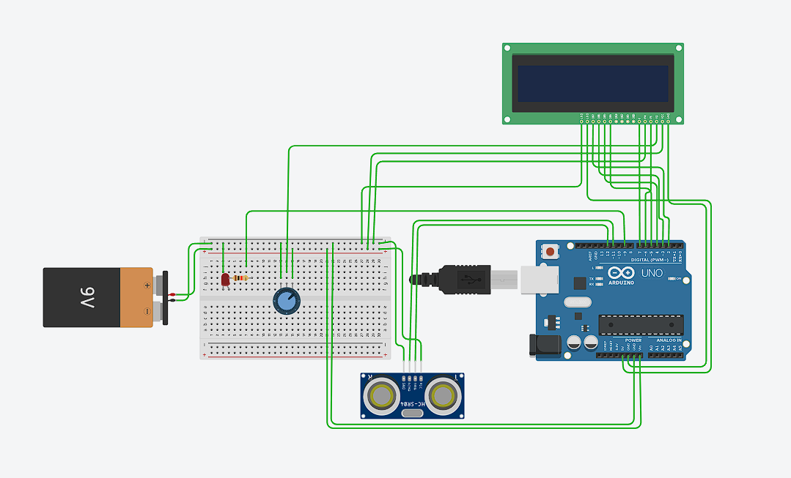

# Proximity Alert System

A small embedded access control system built with Arduino. This project integrates multiple hardware components—including an ultrasonic sensor, IR remote, and LCD screen—to detect motion, authenticate users, and trigger alerts. It was developed to explore embedded systems, sensor integration, and basic RTOS usage on microcontrollers.

---

## Features

- Ultrasonic proximity detection with adjustable threshold  
- IR remote-based authentication  
- Real-time status display on 16x2 LCD  
- Buzzer and LED alerts based on access status  
- FreeRTOS-based task scheduling (used for experience and practice)

---

## Hardware Components

- Arduino Uno R3  
- HC-SR04 Ultrasonic Sensor  
- IR Receiver Module  
- 16x2 LCD (LiquidCrystal)  
- Buzzer  
- LEDs  
- Optional: 5V Relay, Stepper or Servo Motor

---

## System Behavior

- Detects motion using ultrasonic sensor  
- Triggers alert if an unauthorized approach is detected  
- Allows access when user authenticates using IR remote  
- LCD displays real-time system status and feedback

---

## Project Notes

This was an exploratory project to get hands-on with embedded hardware and experiment with FreeRTOS. While the task complexity did not require an RTOS, incorporating it provided useful experience in task structuring, preemption, and timing management in constrained environments.

---

## Repo Structure

```
ProximityAlertSystem/
├── ProximityAlertSystem.ino         # Main Arduino sketch
├── images/
│   └── wiringDiagram.png            # Wiring schematic
├── README.md
```

---

## Wiring Diagram



---

## Troubleshooting

**Buzzer won't stop beeping**  
- Check the distance threshold setting  
- Confirm correct IR code is being received

**LCD not displaying anything**  
- Verify wiring and LCD pin connections  
- Ensure `LiquidCrystal` library is correctly initialized
